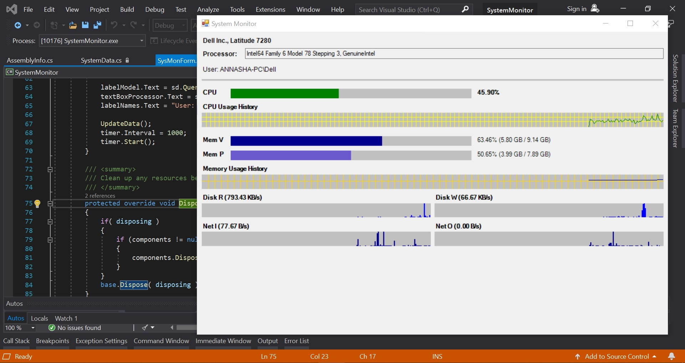
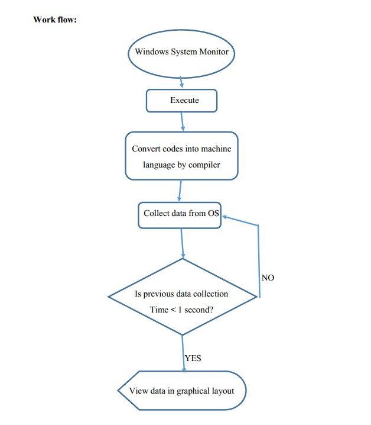

# Windows-System-Monitor
# Abstract
This is a windows platform application which will act as a task manager of a computer. It will collect data of Model no, detailed processor information, CPU status, network status, physical and virtual memory status etc. from computer and show them in one platform. We used C# programming language on Visual Studio with .NET framework for this program. 

# System Requirements 
•	Windows 7/8/10
 •	Visual Studio environment setup
 
•	.NET Framework 4.7

# Software construction 

**•	Model no:** It shows the architecture name and model, version of a computer.
  
**•	Processor:** It shows the processor name with generation.   
**•	User:** Shows user name of the operating system.   
**•	CPU:** CPU is the central processing unit of the computer. A computer's CPU handles all instructions it receives from hardware and software running on the computer. It shows the performance percentage of pc.   
**•	Usage history:** It shows the past CPU usage graphically.   
**•	Mem V:** Virtual memory is a memory management capability of an operating system (OS) that uses hardware and software to allow a computer to compensate for physical memory shortages by temporarily transferring data from random access memory (RAM) to disk storage.   
**•	Mem P:** Primary memory is computer memory that is accessed directly by the CPU. This includes several types of memory, such as the processor cache and system ROM. However, in most cases, primary memory refers to system RAM. It shows usage of RAM status.   
**•	Memory Usage History:** It shows the RAM status graphically.   
**•	Disk R:** It shows the HDD or SSD reading speed.   
**•	Disk W:** It shows the HDD or SSD writing speed. So we can easily find if the disk is busy or not or how much busy it is.   
**•	Net I:** It shows the uploading speed of internet.   
**•	Net O:** It shows the downloading speed of internet. 

# Aplication View:

# Workflow:

